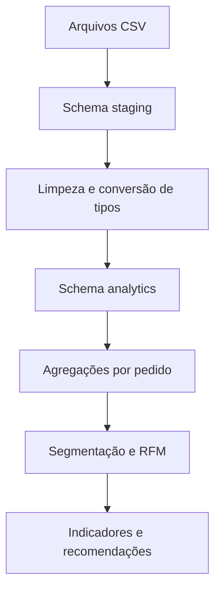

# Análise de clientes com SQL — Olist

Projeto de análise de clientes desenvolvido em PostgreSQL com dados públicos de comércio eletrônico da Olist. O objetivo é transformar dados transacionais em segmentos acionáveis para apoiar estratégias de retenção.

## Pergunta central

> Como o histórico de compras pode ser utilizado para segmentar clientes e apoiar ações de retenção?

## Tecnologias e técnicas

- PostgreSQL e pgAdmin 4
- modelagem em camadas `staging` e `analytics`
- tratamento de textos, datas e valores numéricos
- chaves primárias e estrangeiras
- CTEs e funções de janela
- controle de granularidade em relacionamentos
- segmentação por recência e análise RFM

## Base de dados

Foi utilizado o conjunto público [Brazilian E-Commerce Public Dataset by Olist](https://www.kaggle.com/datasets/olistbr/brazilian-ecommerce), que contém aproximadamente 100 mil pedidos realizados entre 2016 e 2018.

As seis tabelas utilizadas representam clientes, pedidos, pagamentos, itens, produtos e tradução das categorias. Os CSVs não estão incluídos neste repositório; as instruções estão em [`dados/README.md`](dados/README.md).

## Arquitetura da solução



A camada `staging` preserva os dados brutos como texto. A camada `analytics` contém tipos corretos, restrições de integridade e nomes padronizados.

Pagamentos e itens são agregados separadamente por `order_id` antes de serem combinados. Esse cuidado impede que um pedido com vários pagamentos e vários itens multiplique linhas e infle os valores.

## Perguntas de negócio

1. Quantos clientes fizeram compras?
2. Qual é o valor total e mensal recebido?
3. Qual é o ticket médio?
4. Quem são os clientes com maior valor acumulado?
5. Quais clientes compram com maior frequência?
6. Há quanto tempo cada cliente não compra?
7. Quais clientes podem ser considerados ativos, em risco ou inativos?
8. Quais categorias são mais compradas por cada segmento?
9. Qual é a taxa de recompra?
10. Como os clientes podem ser classificados por recência, frequência e valor?

## Regras da análise

- São considerados pedidos com status `delivered` e pagamento registrado.
- O cliente é identificado por `customer_unique_id`.
- O valor analisado é a soma dos pagamentos dos pedidos entregues.
- A recência utiliza como referência a última data de compra presente na base.
- Cliente recorrente é aquele que possui dois ou mais pedidos entregues.
- A classificação de retenção utiliza: até 90 dias como ativo; de 91 a 180 dias como em risco; acima de 180 dias como inativo.

## Principais resultados

Período analisado: **03/10/2016 a 29/08/2018**.

| Indicador | Resultado |
|---|---:|
| Pedidos entregues | 96.477 |
| Clientes únicos | 93.357 |
| Valor total recebido | R$ 15.422.461,77 |
| Ticket médio | R$ 159,86 |
| Ticket mediano | R$ 105,28 |
| Clientes de compra única | 90.556 |
| Clientes recorrentes | 2.801 |
| Taxa de recompra | 3,00% |

O ticket médio ficou aproximadamente 51,8% acima da mediana, indicando influência de pedidos de valor elevado. A taxa de recompra de apenas 3% aponta uma oportunidade relevante de estimular a segunda compra.

### Evolução mensal

O maior valor mensal ocorreu em novembro de 2017: **R$ 1.153.528,05**, distribuídos em **7.289 pedidos entregues**. Em 2018, os valores mensais permaneceram próximos ou superiores a R$ 1 milhão na maior parte do período observado.

O crescimento ocorreu principalmente pelo aumento do volume de pedidos; o ticket médio mensal permaneceu relativamente estável. Os meses iniciais e o final de agosto de 2018 devem ser interpretados com cautela por possível cobertura parcial.

### Segmentação RFM

| Segmento | Clientes | Participação | Valor acumulado | Valor médio por cliente | Recência média |
|---|---:|---:|---:|---:|---:|
| Em risco valiosos | 30.190 | 32,34% | R$ 9.055.190,90 | R$ 299,94 | 281,96 dias |
| Hibernando | 44.647 | 47,82% | R$ 3.243.061,86 | R$ 72,64 | 287,41 dias |
| Novos promissores | 12.084 | 12,94% | R$ 1.947.597,51 | R$ 161,17 | 29,81 dias |
| Alto valor recente | 2.822 | 3,02% | R$ 875.203,32 | R$ 310,14 | 70,68 dias |
| Clientes regulares | 3.554 | 3,81% | R$ 264.456,25 | R$ 74,41 | 74,04 dias |
| Clientes fiéis | 51 | 0,05% | R$ 26.096,11 | R$ 511,69 | 48,94 dias |
| Campeões | 9 | 0,01% | R$ 10.855,82 | R$ 1.206,20 | 16,89 dias |

Os grupos “em risco valiosos” e “hibernando” reúnem 80,16% dos clientes. O primeiro concentra aproximadamente 58,72% do valor recebido e representa a principal prioridade de reativação.

### Categorias por segmento de retenção

| Segmento | Categorias com maior quantidade de itens |
|---|---|
| Ativos | beleza_saude; cama_mesa_banho; utilidades_domesticas; relogios_presentes; esporte_lazer |
| Em risco | cama_mesa_banho; beleza_saude; esporte_lazer; moveis_decoracao; informatica_acessorios |
| Inativos | cama_mesa_banho; esporte_lazer; moveis_decoracao; beleza_saude; informatica_acessorios |

Os valores são analisados dentro de cada segmento. Como os grupos possuem tamanhos diferentes, as contagens absolutas não devem ser usadas isoladamente para comparar afinidade entre segmentos.

## Recomendações

- incentivar rapidamente a segunda compra dos novos clientes;
- priorizar a reativação de clientes afastados com alto valor acumulado;
- oferecer benefícios aos poucos clientes frequentes e recentes;
- personalizar campanhas com base nas categorias já compradas;
- utilizar campanhas de menor custo para clientes hibernando de baixo valor;
- acompanhar a taxa de recompra e a movimentação entre segmentos.

## Limitações

- A base termina em agosto de 2018; a recência é relativa a esse período.
- Os limites de 90 e 180 dias são hipóteses analíticas, não regras oficiais da Olist.
- O valor pago em pedidos entregues é utilizado como aproximação analítica e não como faturamento contábil ou receita líquida.
- A base não possui informações sobre margem, custo de aquisição ou resultados de campanhas.

## Como reproduzir

1. Crie um banco PostgreSQL vazio.
2. Execute `sql/01_criacao_staging.sql`.
3. Baixe e importe os seis CSVs conforme `dados/README.md`.
4. Execute `sql/02_criacao_camada_analytics.sql`.
5. Execute `sql/03_views_analiticas.sql`.
6. Execute `sql/04_analise_clientes.sql`.
7. Utilize `sql/05_resumo_executivo.sql` para gerar as saídas principais.

## Estrutura do repositório

```text
analise-clientes-olist-sql/
├── README.md
├── LICENSE
├── dados/
│   └── README.md
├── imagens/
│   └── README.md
└── sql/
    ├── 01_criacao_staging.sql
    ├── 02_criacao_camada_analytics.sql
    ├── 03_views_analiticas.sql
    ├── 04_analise_clientes.sql
    └── 05_resumo_executivo.sql
```

## Autoria

Projeto desenvolvido por [Liliane Rose Refatti](https://github.com/Lilianerefatti).

