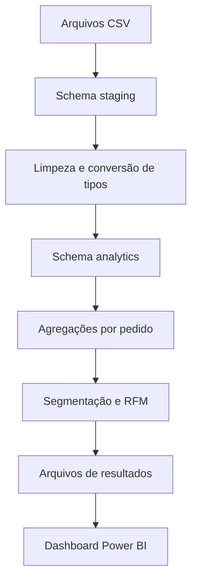
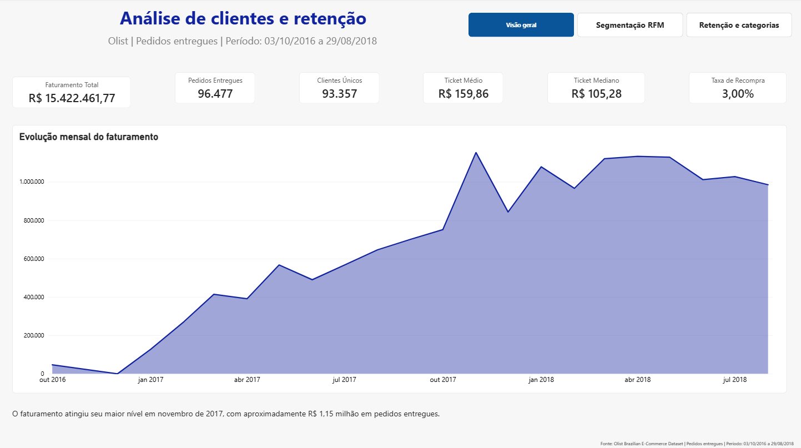
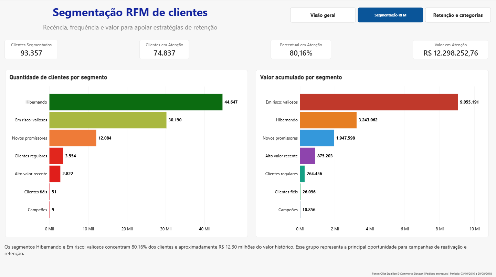
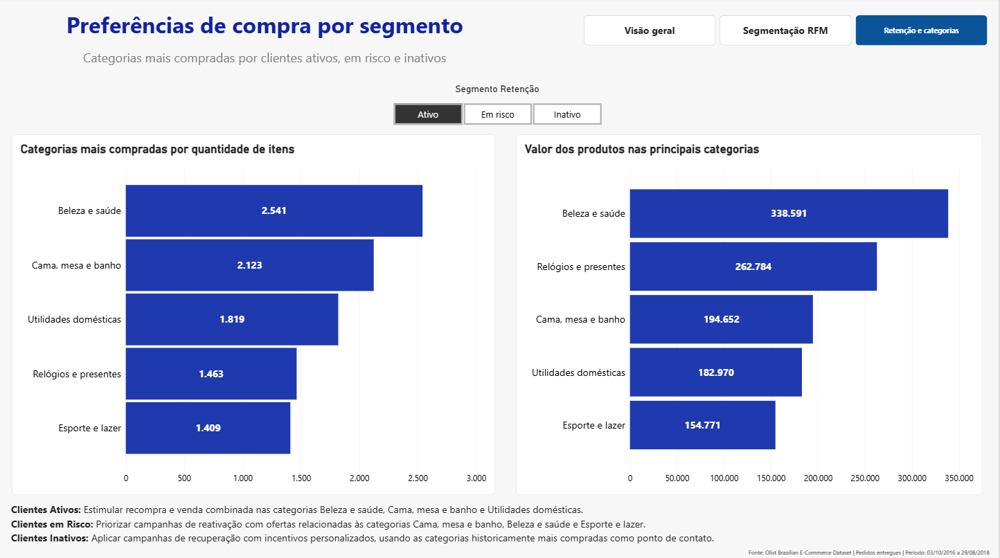

# Análise de clientes com SQL e Power BI — Olist

Projeto de portfólio desenvolvido com PostgreSQL e Power BI a partir de dados públicos de comércio eletrônico da Olist. O trabalho percorre todas as etapas da análise: organização dos dados brutos, criação de uma camada analítica, construção de indicadores, segmentação RFM e apresentação visual dos resultados.

O objetivo é transformar o histórico de compras em informações acionáveis para apoiar estratégias de retenção e relacionamento com clientes.

## Pergunta central

> Como o histórico de compras pode ser utilizado para segmentar clientes e apoiar ações de retenção?

## Tecnologias e técnicas

- PostgreSQL e pgAdmin 4;
- Power BI e Power Query;
- modelagem em camadas `staging` e `analytics`;
- tratamento de textos, datas e valores numéricos;
- chaves primárias e estrangeiras;
- CTEs e funções de janela;
- controle de granularidade nos relacionamentos;
- análise de recência, frequência e valor — RFM;
- criação de medidas DAX e dashboard executivo.

## Base de dados

Foi utilizado o conjunto público [Brazilian E-Commerce Public Dataset by Olist](https://www.kaggle.com/datasets/olistbr/brazilian-ecommerce), com aproximadamente 100 mil pedidos realizados entre 2016 e 2018.

As seis tabelas utilizadas representam clientes, pedidos, pagamentos, itens, produtos e tradução das categorias. Os CSVs originais não estão incluídos neste repositório. As orientações para obtê-los e importá-los estão em [`dados/README.md`](dados/README.md).

## Arquitetura da solução


```mermaid
flowchart TD
    A[Arquivos CSV] --> B[Schema staging]
    B --> C[Limpeza e conversão de tipos]
    C --> D[Schema analytics]
    D --> E[Agregações por pedido]
    E --> F[Segmentação e RFM]
    F --> G[Arquivos de resultados]
    G --> H[Dashboard Power BI]
```

A camada `staging` preserva os dados brutos como texto. A camada `analytics` contém os tipos corretos, restrições de integridade e nomes padronizados.

Pagamentos e itens são agregados separadamente por `order_id` antes de serem combinados. Esse controle evita que pedidos com vários pagamentos e itens multipliquem linhas e inflem os valores.

## Perguntas de negócio

1. Quantos clientes fizeram compras?
2. Qual é o valor total e mensal recebido?
3. Qual é o ticket médio?
4. Quem são os clientes com maior valor acumulado?
5. Quais clientes compram com maior frequência?
6. Há quanto tempo cada cliente não compra?
7. Quais clientes podem ser considerados ativos, em risco ou inativos?
8. Quais categorias são mais compradas por cada segmento?
9. Qual é a taxa de recompra?
10. Como os clientes podem ser classificados por recência, frequência e valor?

## Regras da análise

- são considerados pedidos com status `delivered` e pagamento registrado;
- o cliente é identificado por `customer_unique_id`;
- o valor analisado corresponde à soma dos pagamentos dos pedidos entregues;
- a recência utiliza como referência a última data de compra presente na base;
- cliente recorrente é aquele que possui dois ou mais pedidos entregues;
- a classificação de retenção considera até 90 dias como ativo, de 91 a 180 dias como em risco e acima de 180 dias como inativo.

## Principais resultados

Período analisado: **03/10/2016 a 29/08/2018**.

| Indicador | Resultado |
|---|---:|
| Pedidos entregues | 96.477 |
| Clientes únicos | 93.357 |
| Valor total recebido | R$ 15.422.461,77 |
| Ticket médio | R$ 159,86 |
| Ticket mediano | R$ 105,28 |
| Clientes de compra única | 90.556 |
| Clientes recorrentes | 2.801 |
| Taxa de recompra | 3,00% |

O ticket médio ficou aproximadamente 51,8% acima da mediana, indicando influência de pedidos de valor elevado. A taxa de recompra de apenas 3% demonstra uma oportunidade relevante de estimular a segunda compra.

### Evolução mensal

O maior valor mensal ocorreu em novembro de 2017: **R$ 1.153.528,05**, distribuídos em **7.289 pedidos entregues**. Em 2018, os valores mensais permaneceram próximos ou superiores a R$ 1 milhão na maior parte do período observado.

O crescimento ocorreu principalmente pelo aumento do volume de pedidos, enquanto o ticket médio mensal permaneceu relativamente estável. Os meses iniciais e o final de agosto de 2018 devem ser interpretados com cautela por possuírem cobertura parcial.

### Segmentação RFM

| Segmento | Clientes | Participação | Valor acumulado | Valor médio por cliente | Recência média |
|---|---:|---:|---:|---:|---:|
| Em risco: valiosos | 30.190 | 32,34% | R$ 9.055.190,90 | R$ 299,94 | 281,96 dias |
| Hibernando | 44.647 | 47,82% | R$ 3.243.061,86 | R$ 72,64 | 287,41 dias |
| Novos promissores | 12.084 | 12,94% | R$ 1.947.597,51 | R$ 161,17 | 29,81 dias |
| Alto valor recente | 2.822 | 3,02% | R$ 875.203,32 | R$ 310,14 | 70,68 dias |
| Clientes regulares | 3.554 | 3,81% | R$ 264.456,25 | R$ 74,41 | 74,04 dias |
| Clientes fiéis | 51 | 0,05% | R$ 26.096,11 | R$ 511,69 | 48,94 dias |
| Campeões | 9 | 0,01% | R$ 10.855,82 | R$ 1.206,20 | 16,89 dias |

Os grupos **Em risco: valiosos** e **Hibernando** reúnem 74.837 clientes, equivalentes a **80,16% da base**, e concentram **R$ 12.298.252,76**. O grupo Em risco: valiosos, isoladamente, representa aproximadamente 58,72% de todo o valor recebido e constitui a principal prioridade de reativação.

### Categorias por segmento de retenção

| Segmento | Categorias com maior quantidade de itens |
|---|---|
| Ativos | Beleza e saúde; Cama, mesa e banho; Utilidades domésticas; Relógios e presentes; Esporte e lazer |
| Em risco | Cama, mesa e banho; Beleza e saúde; Esporte e lazer; Móveis e decoração; Informática e acessórios |
| Inativos | Cama, mesa e banho; Esporte e lazer; Móveis e decoração; Beleza e saúde; Informática e acessórios |

As categorias são analisadas dentro de cada segmento. Como os grupos possuem tamanhos diferentes, suas contagens absolutas não devem ser utilizadas isoladamente para comparar afinidade entre segmentos.

## Dashboard no Power BI

O dashboard foi organizado em três páginas complementares.

### 1. Visão geral

Apresenta o período analisado, valor total recebido, quantidade de pedidos e clientes, tickets médio e mediano, taxa de recompra e evolução mensal.



### 2. Segmentação RFM

Compara o tamanho e o valor acumulado dos segmentos, destacando os clientes que exigem maior atenção para ações de retenção.



### 3. Retenção e categorias

Permite selecionar os grupos Ativo, Em risco e Inativo e examinar as categorias com maior quantidade de itens e maior valor de produtos.



O arquivo editável está disponível em [`powerbi/dashboard_analise_clientes_olist.pbix`](powerbi/dashboard_analise_clientes_olist.pbix).

## Conclusões

- A base possui **93.357 clientes**, mas apenas **2.801** realizaram ao menos uma recompra.
- A taxa de recompra de **3%** mostra que a retenção é o principal ponto de atenção da operação analisada.
- O valor total recebido chegou a **R$ 15,42 milhões**, com pico em novembro de 2017.
- A diferença entre ticket médio e mediano revela a influência de uma parcela menor de pedidos de alto valor.
- Mais de 80% dos clientes estão nos segmentos Hibernando ou Em risco: valiosos.
- Os clientes Em risco: valiosos combinam alto valor histórico e longo período sem comprar, formando a prioridade mais relevante para ações de recuperação.
- Os Novos promissores representam oportunidade de conversão para uma segunda compra antes que migrem para grupos de maior recência.

## Recomendações de negócio

- criar campanhas de segunda compra para novos clientes, com comunicação em uma janela curta após o primeiro pedido;
- priorizar clientes Em risco: valiosos com ofertas personalizadas e baseadas nas categorias já compradas;
- adotar campanhas de menor custo para clientes Hibernando de baixo valor;
- oferecer benefícios de relacionamento aos poucos clientes frequentes e recentes;
- adaptar as campanhas às categorias preferidas de cada segmento de retenção;
- acompanhar periodicamente a taxa de recompra e a movimentação dos clientes entre segmentos;
- testar as ações com grupos de controle antes de ampliar o investimento.

## Arquivos de resultados

Os dados consolidados utilizados pelo Power BI estão disponíveis na pasta [`resultados`](resultados):

- [`indicadores_gerais.csv`](resultados/indicadores_gerais.csv);
- [`evolucao_mensal.csv`](resultados/evolucao_mensal.csv);
- [`segmentos_rfm.csv`](resultados/segmentos_rfm.csv);
- [`categorias_por_segmento.csv`](resultados/categorias_por_segmento.csv).

## Limitações

- A base termina em agosto de 2018; portanto, a recência é relativa a esse período.
- Os limites de 90 e 180 dias são hipóteses analíticas, e não regras oficiais da Olist.
- O valor pago em pedidos entregues é utilizado como aproximação analítica, não como faturamento contábil ou receita líquida.
- A base não possui informações sobre margem, custo de aquisição de clientes ou resultados de campanhas.
- Os resultados descrevem o período e a base analisados e não devem ser generalizados sem validação adicional.

## Como reproduzir a análise

1. Crie um banco de dados vazio no PostgreSQL.
2. Execute o script de criação da camada `staging`.
3. Baixe e importe os seis CSVs conforme as orientações de [`dados/README.md`](dados/README.md).
4. Execute os demais scripts da pasta [`sql`](sql) seguindo a ordem numérica.
5. Execute `resumo geral.sql` para gerar as saídas consolidadas.
6. Exporte as consultas para a pasta `resultados` ou utilize os CSVs já disponibilizados.
7. Abra [`dashboard_analise_clientes_olist.pbix`](powerbi/dashboard_analise_clientes_olist.pbix) no Power BI Desktop.

> Ao mover o projeto para outro diretório, pode ser necessário atualizar os caminhos dos arquivos CSV em **Transformar dados → Configurações da fonte de dados** no Power BI.

## Estrutura do repositório

```text
analise-clientes-olist-sql/
├── README.md
├── LICENSE
├── dados/
│   └── README.md
├── imagens/
│   ├── dashboard_visao_geral.png
│   ├── dashboard_segmentacao_rfm.png
│   └── dashboard_retencao_categorias.png
├── powerbi/
│   └── dashboard_analise_clientes_olist.pbix
├── resultados/
│   ├── indicadores_gerais.csv
│   ├── evolucao_mensal.csv
│   ├── segmentos_rfm.csv
│   └── categorias_por_segmento.csv
└── sql/
    ├── 01_criacao_staging.sql
    ├── 02-exploração_inicial.sql
    ├── 03_criacao_camada_analytics.sql
    ├── 04_views_analiticas.sql
    ├── 05_analise_clientes.sql
    └── resumo geral.sql
```

## Autoria

Projeto desenvolvido por [Liliane Rose Refatti](https://github.com/Lilianerefatti).

Dados: [Brazilian E-Commerce Public Dataset by Olist](https://www.kaggle.com/datasets/olistbr/brazilian-ecommerce).
